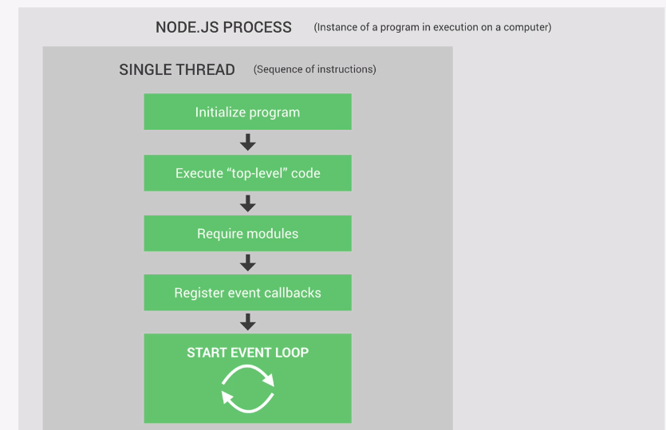
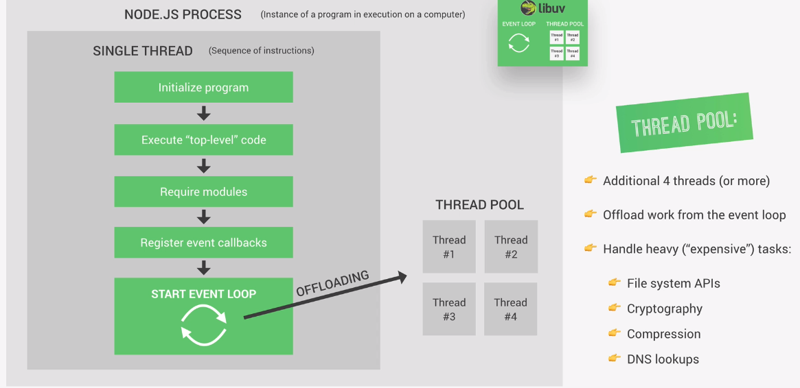
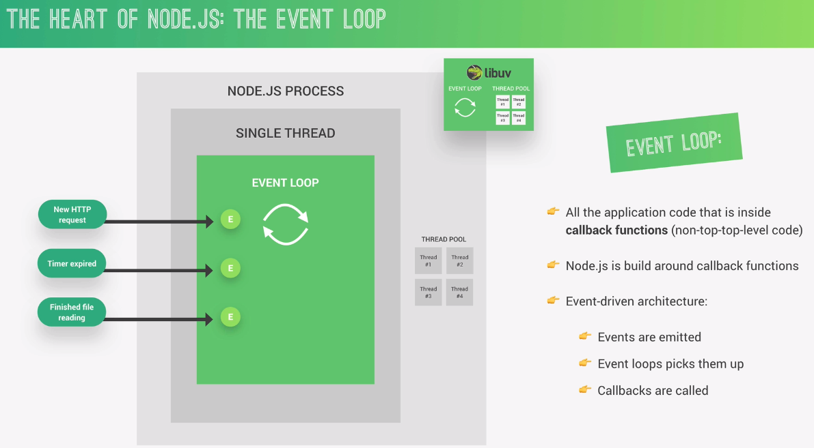
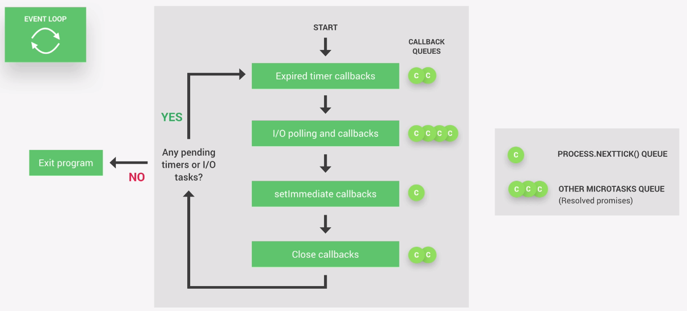
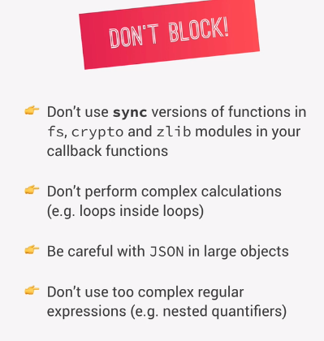

# Basics on Node JS

## Node has several run-time dependencies, in which the major ones are **_NODE V8 Engine_** and **_libuv_**

* V8 is the sole reason that machine can understand javascript, it converts the javascript code to machine code
* libuv is mainly used to achieve the asynchronous IO nature in node.
* libuv(written in C++) is also responsible for implementing features in node called **_Event Loop and Thread Pool_**
* Event Loop is responsible for execution of tasks via callbacks, orchestration of callbacks, registering events for callbacks and take care of all incoming events.
* It is also dependent on http-parser, c-ares (for DNS),OpenSSL (for cryptography) and zlib(for compression)

# Node Js Architecture

> Process = Program in execution

> Thread  = sequence of instructions obtained from process

> Node JS Runs on SINGLE THREADED APPLICATION, no matter how many connections you get to server, it is all handled by single thread.

* Top level means, the code with out any call backs 
* In the event loop, the most of work by server is here. If we get any heavy/time consuming applications then that task will be handed over to thread pool.
* By default, we have 4 additional threads in thread pool and we can configure upto 128
* The things you see on Right most end are the tasks which are taken care by thread pool leaving server open to focus on little tasks.

# Node JS Event Loop

1. this is nothing but code that is inside callback functions in execution
2. though some parts are sent to thread pool, after their completion in threads, we do receive an event regarding status
3. Node JS is built around call back functions, which are similar to functions only these are called after execution of some task or program
4. This is way Node is called as Event-Driven Programming Language (see pt 3 & 4)

5. Event Loop does the **_orchestration_**
6. Event Loop has multiple phases and for each phase we have call back queues (After code execution completion and getting status of it, the event loops receives the code from call back function and if have many such functions all of them are placed in a queue)
7. ## Call Back Phases:
    1. **Expired timer callbacks**:
        1. handles the callback code of expired timers. Ex: setTimeout.
        2. these are the first one to execute in an event loop
    2. **IO Pooling and callbacks**:
        1. looking and executing for IO operations
        2. this is where **_99%_** of our code is being executed
    3. **Set Immediate Callback**: execute some code just after completion of IO operations

    4. **Close callbacks**: mostly used in database connections, socket connections, and file operations etc.
    5. **Process.nextTick** : which is mainly used for resolved promises.
    6. others generally include **resolved promises itself (execution of then blocks)**

> ##  NOTE: If any callbacks present In 5,6 THEN THEY ARE EXECUTED RIGHT AFTER CURRENT PHASE OF EVENT LOOP(WHICH ARE ANY ONE OF FIRST FOUR) INSTEAD OF WAITING FOR ENTIRE EVENT LOOP TO FINISH. 

Basic Guidelines for unblocking code in node

